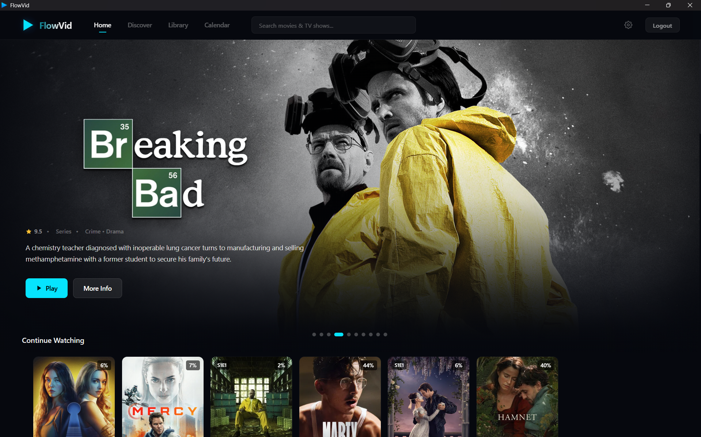
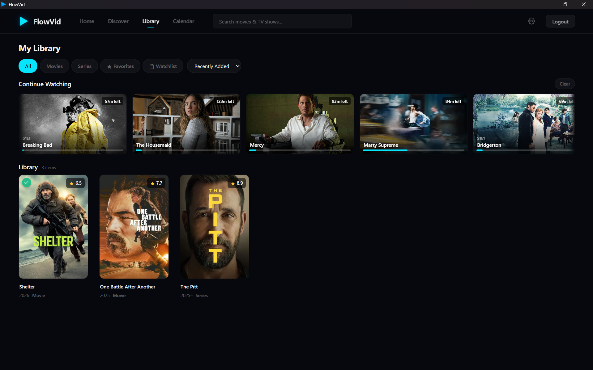
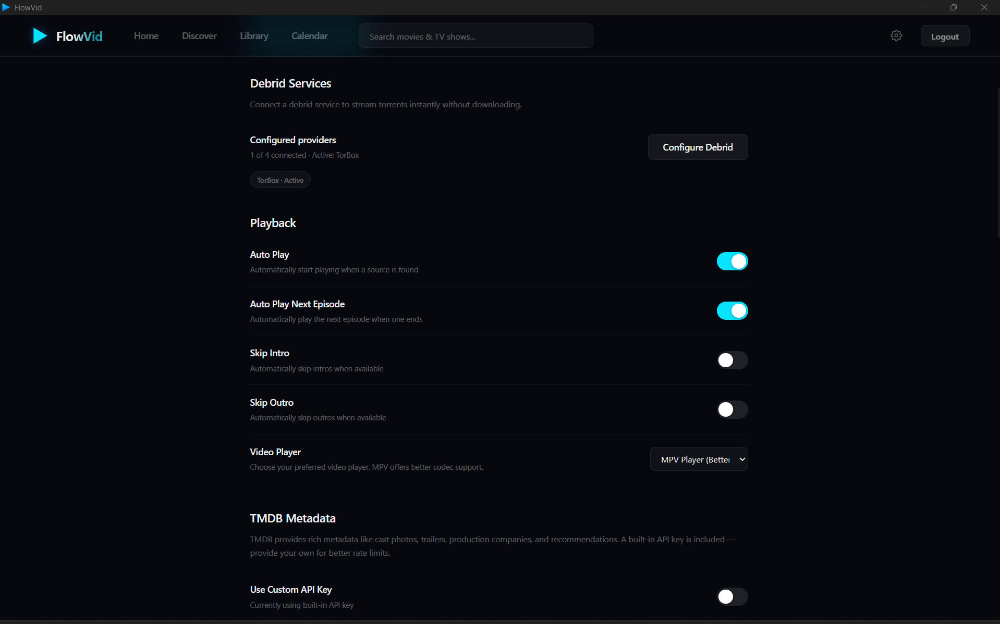

  

<h1 align="center">FlowVid</h1>

  <strong>Stream everything. One app. No limits.</strong> 
  A beautiful, native desktop streaming client powered by debrid services.

  
  
  

---

## What is FlowVid?

FlowVid is a native streaming application that gives you a Netflix-like experience for all your media. Browse, search, and stream movies and TV shows instantly through your debrid service — no buffering, no hassle, no limits.

Built from the ground up with **Tauri** and **React**, FlowVid is lightweight, fast, and supports codecs that browser-based players can't touch — including **4K HDR, Dolby Vision, DTS, and Dolby Atmos** through the embedded MPV player.

---

## How It Works

1. **Browse** — Explore popular movies, trending series, top-rated content, or search for anything
2. **Pick a source** — FlowVid finds available sources and checks your debrid cache instantly
3. **Stream** — Your debrid service delivers a direct HTTPS stream. Press play and enjoy
4. **Resume anywhere** — Your progress, subtitles, and audio selection are saved automatically

---

## Screenshots

### Home

### Library

### Settings

---

## Key Features

### Streaming & Playback
- **Dual player engine** — HTML5 for quick playback, embedded MPV for full codec support (4K, HDR10, Dolby Vision, DTS, Atmos, AV1, HEVC)
- **Instant cache checking** — see which sources are already cached on your debrid service before you pick one
- **Resume playback** — automatically saves your position, selected source, subtitles, and audio track
- **Auto-play next episode** — binge without interruptions

### Discovery & Organization
- **Curated rows** — Popular, Top Rated, and personalized recommendations on launch
- **Discover page** — filter by genre, year, rating, language, and sort order (powered by TMDB)
- **Full-text search** — find movies and series with category tabs and result counts
- **Personal library** — watchlist, favorites, ratings, notes, tags, and custom collections
- **Continue Watching** — pick up exactly where you left off with progress bars

### Subtitles & Audio
- **30+ subtitle languages** via OpenSubtitles — no API key required
- **Subtitle customization** — font, size, color, background, and timing offset
- **Full audio track selection** — language, codec, and channel layout info (2.0, 5.1, 7.1)

### Multi-Profile Support
- **Up to 8 profiles** per account — each with separate library, watch history, and preferences
- **"Who's watching?"** profile picker on launch, switch anytime without logging out
- **Cross-device sync** — library, history, settings, and collections stay in sync

### Debrid Providers
- **Real-Debrid** · **AllDebrid** · **TorBox** · **Premiumize**
- Real-time API key validation
- Batch cache checking (up to 100 hashes at once)
- Automatic rate limiting with exponential backoff

---

## What You Get with FlowVid+

| Feature | Free | FlowVid+ |
|---------|:----:|:--------:|
| Stream via debrid | ✓ | ✓ |
| Subtitles & audio tracks | ✓ | ✓ |
| Search & browse | ✓ | ✓ |
| Library & watch history | ✓ | ✓ |
| Cross-device sync | ✓ | ✓ |
| Native scraping engine | — | ✓ |
| Multiple profiles (up to 8) | — | ✓ |
| Priority source ranking | — | ✓ |

---

## Tech Stack

| Component | Technology |
|-----------|-----------|
| Desktop App | Tauri v2, React 18, TypeScript, Zustand |
| Backend | Node.js, Express, SQLite (better-sqlite3) |
| Player | Embedded MPV (libmpv) + HTML5 fallback |
| Metadata | Cinemeta + TMDB enrichment |
| Subtitles | OpenSubtitles (no key required) |
| Billing | Dodo Payments (Merchant of Record) |

---

## Safety

FlowVid includes a **Safety Gate** — a hard-coded enforcement layer that ensures all playback resolves to valid HTTPS debrid URLs. Direct P2P connections are blocked under all circumstances, with no override or bypass.

---

## License

MIT

---

## Disclaimer

FlowVid does not host, store, or distribute any content. It is a player interface that connects to user-configured debrid services. Users are solely responsible for the services they configure and the content they access.
